# Barents Watch Project

This project uses Quarkus and Angular. Backend part uses data from API of 
[Barents Watch](https://www.barentswatch.no/). It is needed to create there user account and client to acquire
credentials to use this app (after logging, go to 'My Page' and 'API access' tab). Then set 
`barents-watch.access.client-id` and `barents-watch.access.client-secret` in `application.properties` file.

Required setup:
- Java 17
- NodeJS 16.13.1
- Angular 13.1.2
- Docker

## Running the application in dev mode

Firstly there is need to set up databases. In main project path there is `docker-compose.yml` file to make
it happened.
```shell script
docker-compose up -d
```

After running dockers with databases and setting properties with credentials write below command into terminal
to run backend being in backend directory.
```shell script
./mvnw compile quarkus:dev
```

When backend is ready go to frontend directory and run fronted written in Angular.
```shell script
ng serve
```

Then go to `localhost:4200` and check if app is running.

## App functionalities

After launching app on localhost and opening browser there will be shown such screen.

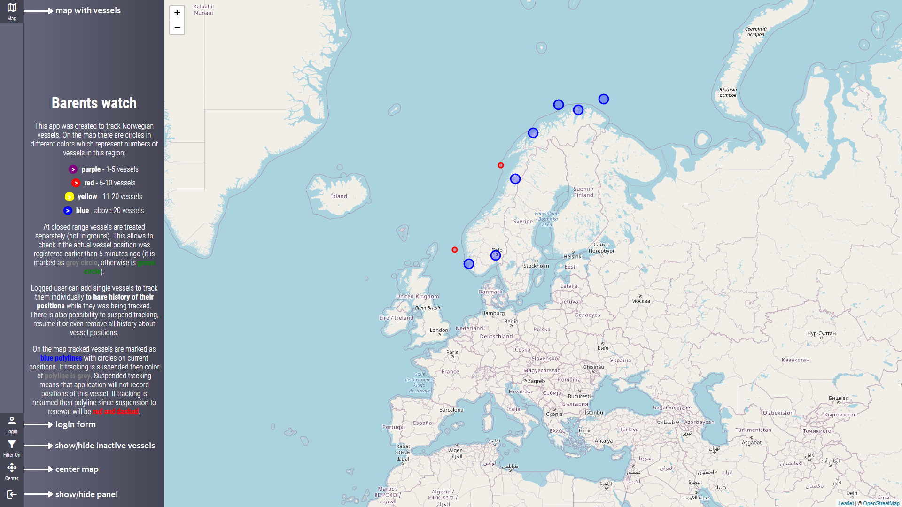

Bigger part of screen is occupied by map with circles which represents groups of vessels. Different colors
indicates different number of vessels. Legend is shown on map panel. On the left side there is toolbar with
buttons.
- Map - shows map and info about it on panel
- Login - shows login form
- Filter On/Off - shows/hides inactive vessels on map
- Center - centers map
- Hide/show panel


After choosing login button there will appear login form. Typing right credentials and clicking 
login button will redirect to app panel. If you want to register to app choose 'Sing In' option.

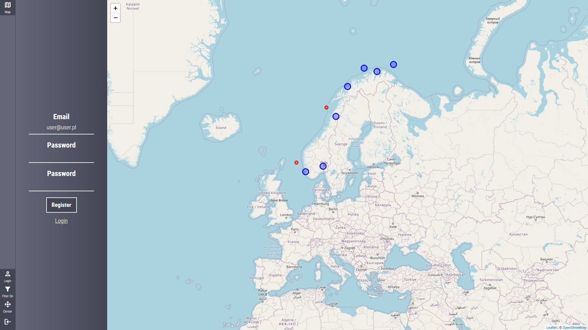

When we zoom in being on map panel than instead of group of vessels we will see individual vessels
just like on screen below. They will be active or inactive (if difference of vessel position timestamp
and current timestamp is greater than 5 minutes). By the way the panel is hidden by clicking last 
button on toolbar.

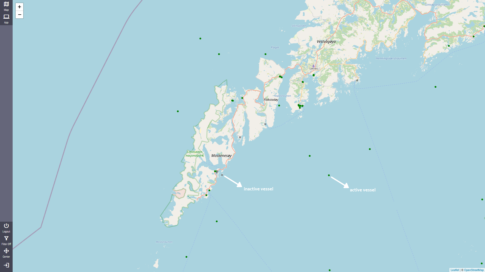

If we choose one of vessel then on popup we will see information about it. There will be: 
MMSI (vessel id), name, type, destination and timestamp of last position. If we are logged in on
popup will be also plus button to add this vessel to tracking.


After clicking plus button the vessel will be tracked and in top right corner will appear toastr
with proper information.

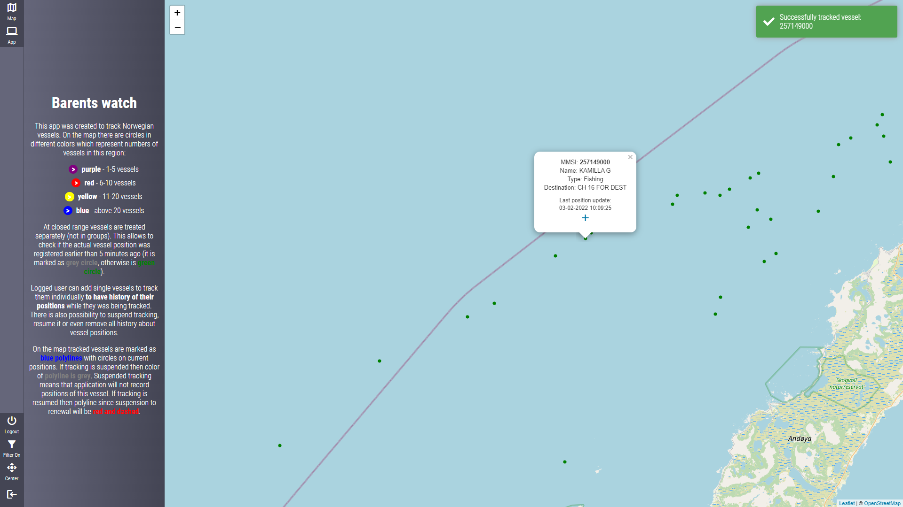

There are of course some limitation of adding vessels to tracking. We cannot add vessel to tracking if:
- it is already tracked
- there are 10 actively tracked vessels (not suspended)
- there are 15 tracked vessels in total

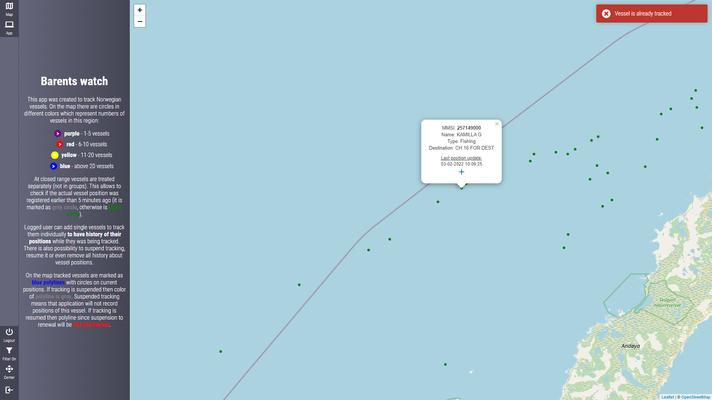

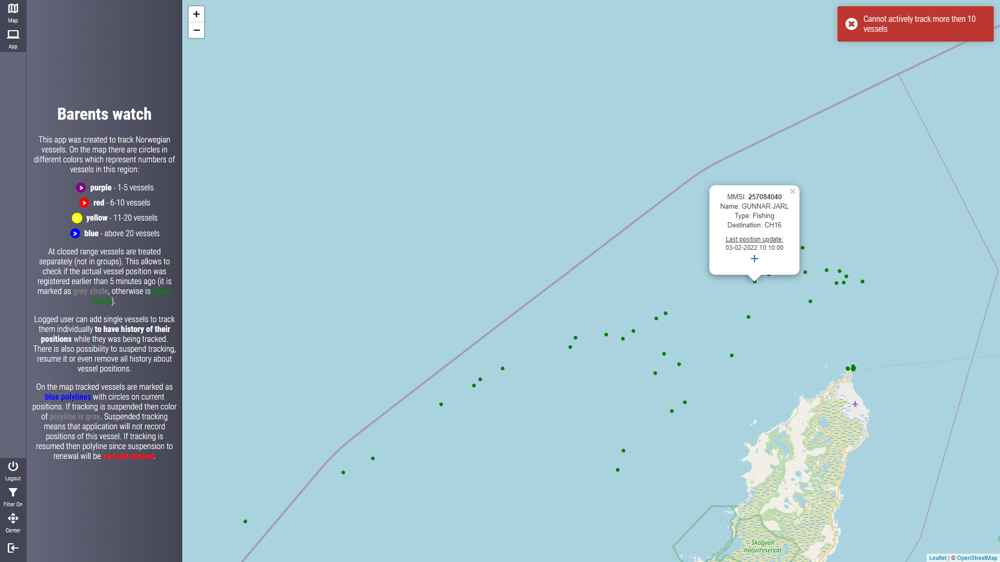

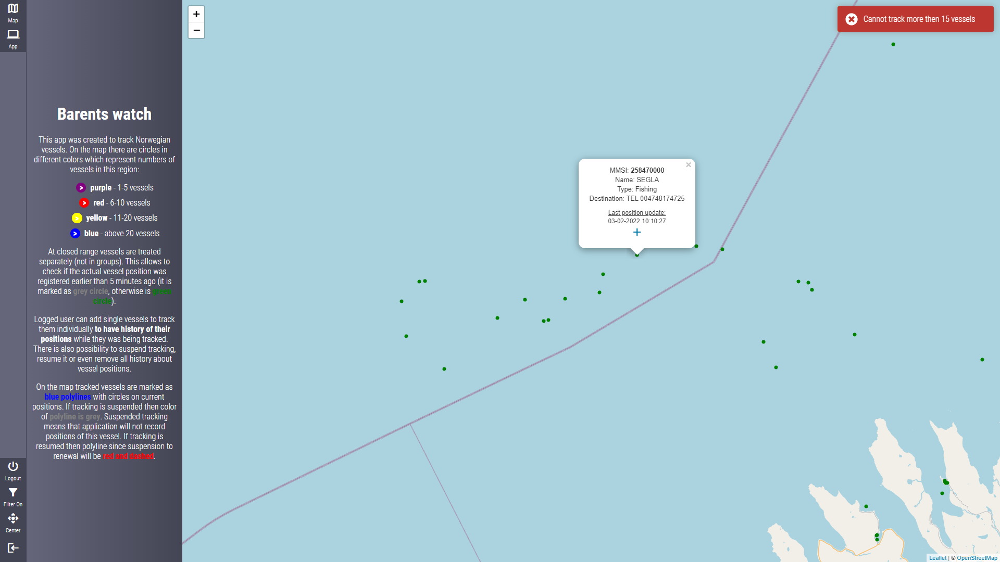

When we go to app panel we will see all vessels that we have chosen to tracking. Some of them are
suspended. We have there 4 options:
- Show information
- Adjust to vessel's current position 
- Suspend/resume tracking
- Remove tracking

On the map some vessels are blue, these are tracked. Some of them are grey, these are suspended
from tracking. Of course if vessel is tracked then on map we will see line representing its
historical positions since it is tracked.

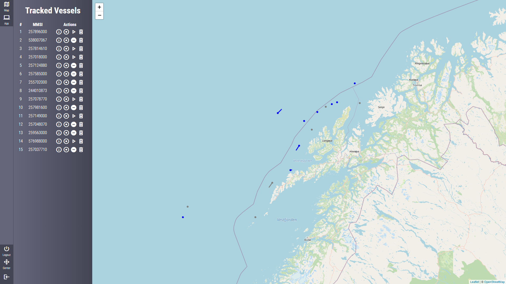

Clicking info button will show model with vessel's information - MMSI, name, type and all coordinates
when vessel has been tracked. If vessel's tracking has been suspended for some time and then resumed
again there will be blocks of positions.

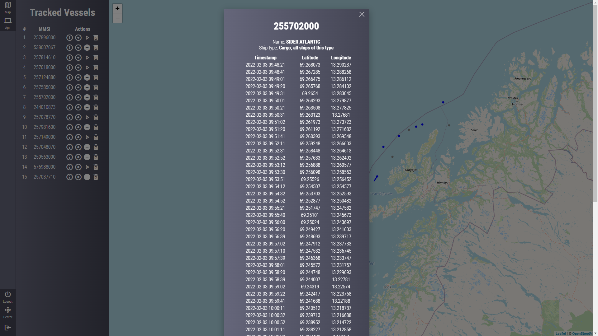

When we zoom to one of tracked vessels we will se that current position is marked with circle. Line will
be blue and some of it will be red and dashed. It means that then vessel has not been tracked for that
period of time.


Suspended vessel will be grey on map and break in tracking will be pink and dashed.

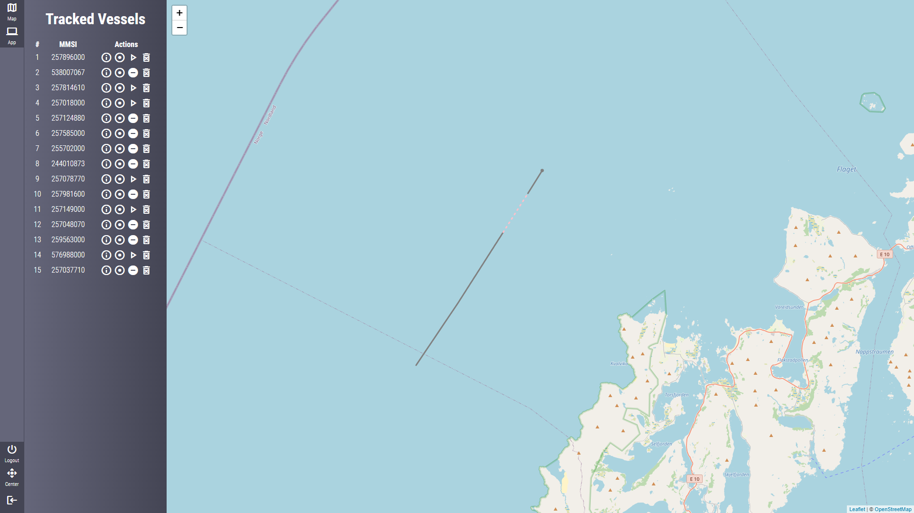

If we add vessel to track again after some time it will be blue again and will have one more red and
dashed line segment.


Below we will see map with tracked vessel after long period of time.

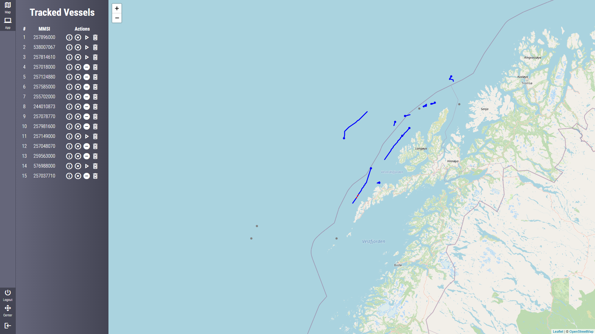

## Inspiration

To develop this app I was inspired by Przemysław Bykowski's blog and
[his article](https://bykowski.pl/wez-udzial-w-konkursie-programistycznym-monitorowanie-jednostek-morskich/) 
about contest which he has organised. 